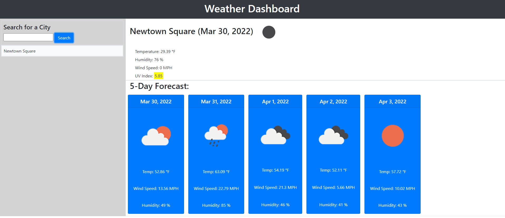

# weather-dashboard

## Description

This website utilizes the Open Weather Map API to display the current weather of a city and also display the 5 day forecast as well.

---

## Screenshots

## Installation

In order to download and run this project, you may:

- Clone the repository through Git, then run the directory in Visual Studio Code. Afterwards, run index.html and launch through the web browser of your choice.
- Download the .zip of the repository, then extract it. Afterwards, open the folder through Visual Studio Code, or launch the index.html file directly.
- Alternatively, if you want to view only the website without having the files, you can view the website by following this link: https://jakekeebler.github.io/work-day-scheduler/

---

## Usage

Search for a city to see get information on the current and future weather!

---

## Credits

Jared Keebler

---

## License

No license required.

---

